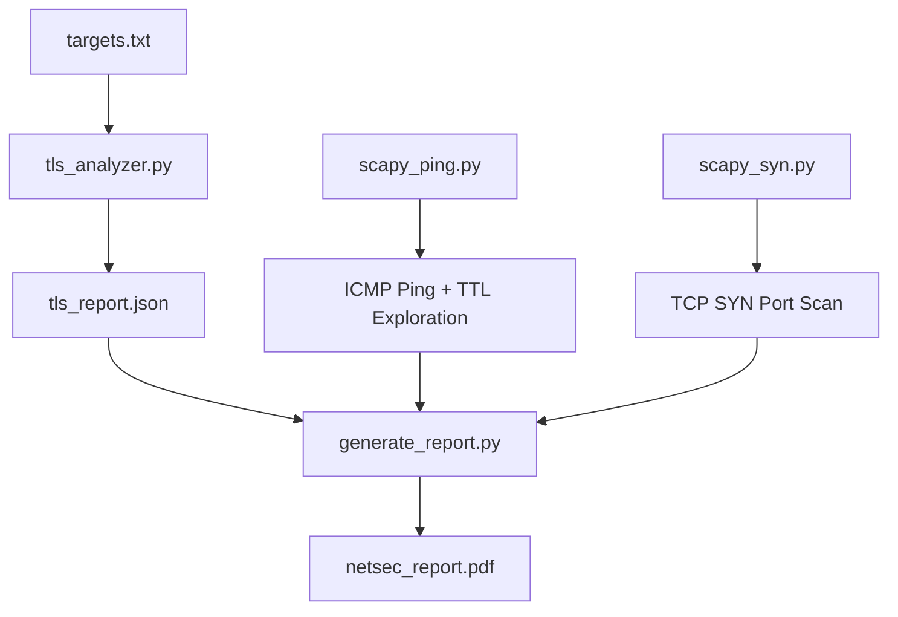

# NetSec Toolkit

> Network security analysis suite: ICMP ping, TCP SYN scanner, and TLS certificate analyzer


One expired TLS certificate took down a production endpoint for hours. I built this toolkit to detect exactly those kinds of misconfigurations: expired certs, self-signed certs, hostname mismatches, outdated TLS versions. It also includes ICMP ping/traceroute and TCP SYN scanning for full network reconnaissance.

## What It Does

Three standalone tools for network security analysis, plus a PDF report generator that compiles findings into a professional document.

- **scapy_ping.py** sends raw ICMP echo requests and walks TTL values to map intermediate hops between you and the target.
- **scapy_syn.py** performs a TCP SYN scan against a list of ports, classifying each as open, closed, or filtered based on the response flags.
- **tls_analyzer.py** connects to TLS endpoints, extracts certificate metadata, and flags expired certs, self-signed certs, hostname mismatches, and outdated protocol versions.
- **generate_report.py** aggregates all scan results into a formatted PDF with tables, screenshots, and analysis sections.

## Architecture



## Features

**ICMP Ping and TTL Exploration**
- Sends raw ICMP echo requests using Scapy with precise RTT measurement
- Walks TTL values (1, 5, 10) to trace the network path, observing Time Exceeded responses from intermediate routers

**TCP SYN Port Scanner**
- Crafts raw TCP packets with the SYN flag set and sends them to each target port
- Classifies ports as open (SYN-ACK), closed (RST-ACK), or filtered (no response)
- Sends a proper RST after receiving SYN-ACK to tear down the half-open connection cleanly

**TLS Certificate Analyzer**
- Connects over TLS with certificate verification disabled to inspect even broken endpoints
- Extracts subject CN, Subject Alternative Names, issuer chain, validity dates, TLS version, and cipher suite
- Detects four classes of misconfiguration: expired certificates, self-signed certificates, hostname mismatches, and outdated TLS versions (TLS 1.0 and 1.1)
- Handles wildcard certificate matching with proper label-count validation
- Outputs structured JSON for programmatic consumption

**PDF Report Generator**
- Produces a professional multi-section security report with a title page, headers, footers, and page numbers
- Renders tables with alternating row colors, section numbering, and embedded screenshots
- Uses a navy/accent color palette with clean typography

## Usage

All scanning tools require root privileges because they craft raw packets at the network layer.

### ICMP Ping and TTL Exploration

```bash
sudo python3 scapy_ping.py
```

Sends an ICMP echo request to `scanme.nmap.org` and then probes `google.com` with TTL values of 1, 5, and 10 to observe the path.

### TCP SYN Port Scan

```bash
sudo python3 scapy_syn.py
```

Scans ports 22, 80, 443, and 9929 on `scanme.nmap.org`. Each port is probed with a single SYN packet. Open ports receive a RST to close the half-open connection.

### TLS Certificate Analysis

```bash
python3 tls_analyzer.py targets.txt
```

Reads host:port pairs from the targets file, connects to each, and outputs a JSON array of findings. No root privileges needed since this uses standard TLS sockets.

**Pipe to a file for later use:**

```bash
python3 tls_analyzer.py targets.txt > tls_report.json
```

### PDF Report Generation

```bash
python3 generate_report.py
```

Reads scan outputs from `output/` and `tls_report.json`, then generates `netsec_report.pdf`.

## Example Output

### TLS Analyzer against badssl.com endpoints

Running against the test targets in `targets.txt`:

```
$ python3 tls_analyzer.py targets.txt
[
  {
    "target": "badssl.com:443",
    "tls_version": "TLSv1.2",
    "cipher_suite": "ECDHE-RSA-AES128-GCM-SHA256",
    "leaf_certificate": {
      "subject_cn": "*.badssl.com",
      "is_expired": false,
      "hostname_match": true
    },
    "issues": []
  },
  {
    "target": "expired.badssl.com:443",
    "tls_version": "TLSv1.2",
    "leaf_certificate": {
      "subject_cn": "*.badssl.com",
      "is_expired": true,
      "hostname_match": true
    },
    "issues": ["Expired certificate"]
  },
  {
    "target": "self-signed.badssl.com:443",
    "leaf_certificate": {
      "subject_cn": "*.badssl.com",
      "is_expired": false,
      "hostname_match": true
    },
    "issues": ["Self-signed certificate"]
  },
  {
    "target": "wrong.host.badssl.com:443",
    "leaf_certificate": {
      "subject_cn": "*.badssl.com",
      "is_expired": false,
      "hostname_match": false
    },
    "issues": ["Hostname mismatch"]
  },
  {
    "target": "tls-v1-0.badssl.com:1010",
    "error": "[SSL: SSLV3_ALERT_HANDSHAKE_FAILURE] ..."
  }
]
```

The analyzer correctly identifies each misconfiguration class: the expired cert on `expired.badssl.com`, the self-signed cert on `self-signed.badssl.com`, the hostname mismatch on `wrong.host.badssl.com` (a wildcard `*.badssl.com` cert does not match a three-level subdomain), and the handshake failure on the TLS 1.0 endpoint where modern OpenSSL refuses to negotiate a deprecated protocol.

### TCP SYN Scan

```
$ sudo python3 scapy_syn.py
Port 22:    open
Port 80:    open
Port 443:   closed
Port 9929:  open
```

## How It Works

### TCP SYN Scanning

A SYN scan (sometimes called a "half-open" scan) exploits the TCP three-way handshake to determine port state without completing a full connection. The scanner crafts a raw TCP packet with only the SYN flag set (`flags="S"`) and sends it to the target port. Three outcomes are possible:

1. **SYN-ACK (flags `0x12`)**: The target's TCP stack responded with SYN-ACK, meaning the port is open and a service is listening. The scanner immediately sends a RST packet to tear down the half-open connection, preventing it from appearing in the target's application logs. This is the key advantage of SYN scanning over a full `connect()` call.

2. **RST-ACK (flags `0x14`)**: The target sent a reset, meaning the port is closed. No service is listening, but the host is reachable.

3. **No response (timeout)**: The packet was dropped by a firewall or filtering device. The port is classified as filtered.

The scanner sends the RST using the correct sequence number (`seq=reply[TCP].ack`) so the target's TCP stack accepts it and cleans up the half-open connection state.

### TLS Certificate Validation

The TLS analyzer connects with `check_hostname=False` and `verify_mode=ssl.CERT_NONE` intentionally. This allows it to inspect certificates that would normally cause a connection failure, which is the whole point: you want to detect broken certificates, not refuse to connect to them.

After the TLS handshake completes, the analyzer extracts the DER-encoded certificate bytes and parses them with the `cryptography` library to get structured access to the X.509 fields. It then runs four detection rules:

**Expired certificates.** Compares the current UTC time against the certificate's `notAfter` field. If `now > not_after`, the cert is expired. An expired certificate means browsers will show a full-page security warning, breaking user trust and potentially blocking automated API clients entirely.

**Self-signed certificates.** Checks whether `subject == issuer` on the leaf certificate. A self-signed cert has no chain of trust to a recognized Certificate Authority, so browsers and TLS clients will reject it by default. This detection catches development certificates that accidentally made it to production.

**Hostname mismatch.** Verifies that the hostname you connected to matches either the Subject CN or one of the Subject Alternative Names (SANs) on the certificate. The SAN check takes priority over CN, following RFC 6125. This catches cases where a certificate was issued for one domain but deployed on a different one.

### Wildcard Certificate Matching

Wildcard matching follows a strict rule: a `*.example.com` certificate matches `foo.example.com` but not `bar.foo.example.com`. The implementation splits both the pattern and the hostname on dots, requires the same number of labels, and then compares every label except the first (which is the wildcard). This prevents a `*.badssl.com` cert from falsely matching `wrong.host.badssl.com`, a three-label hostname that has more parts than the two-label wildcard pattern allows.

### Outdated TLS detection

The analyzer checks whether the negotiated TLS version is in the set `{"TLSv1", "TLSv1.1"}`. Both versions have known vulnerabilities (BEAST, POODLE) and were formally deprecated by RFC 8996 in 2021. Modern OpenSSL builds often refuse to negotiate these versions at the library level, which is why the TLS 1.0 test endpoint in `targets.txt` produces a handshake failure rather than a successful connection with a version warning.

## Testing

The test targets in `targets.txt` use [badssl.com](https://badssl.com), a public service that hosts intentionally misconfigured TLS endpoints for testing. Each endpoint isolates a single failure mode:

| Endpoint | Expected Issue |
|----------|---------------|
| `badssl.com:443` | None (valid certificate) |
| `expired.badssl.com:443` | Expired certificate |
| `self-signed.badssl.com:443` | Self-signed certificate |
| `wrong.host.badssl.com:443` | Hostname mismatch |
| `tls-v1-0.badssl.com:1010` | Outdated TLS version (handshake failure on modern systems) |

The ICMP and SYN scan tools target `scanme.nmap.org`, a server explicitly provided by the Nmap project for authorized testing.

## Requirements

- Python 3.11+
- Root/sudo access for raw packet tools (scapy_ping.py, scapy_syn.py)

Install dependencies:

```bash
pip install -r requirements.txt
```

| Package | Purpose |
|---------|---------|
| [scapy](https://scapy.net/) | Raw packet crafting and sending (ICMP, TCP) |
| [cryptography](https://cryptography.io/) | X.509 certificate parsing and inspection |
| [fpdf2](https://py-pdf.github.io/fpdf2/) | PDF report generation |

## Related Projects

Part of a 5-project security research portfolio: [Secure Vault](https://github.com/FardinIqbal/secure-vault) (password manager), [Argus](https://github.com/FardinIqbal/argus) (passive network sniffer), [tcpscan](https://github.com/FardinIqbal/tcpscan) (TCP scanner), [x86 Exploit Lab](https://github.com/FardinIqbal/x86-exploit-lab) (buffer overflow research).

## License

[MIT](LICENSE)
