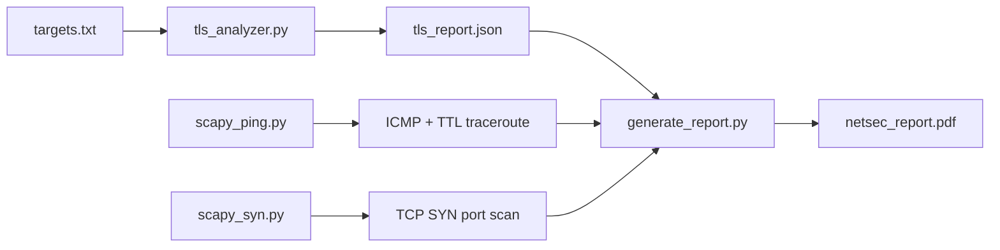

# NetSec Toolkit

> Three Python tools for network security analysis: ICMP ping/traceroute, TCP SYN scanner, and TLS certificate analyzer — plus a PDF report generator.


A three-tool security suite that detects 4 classes of TLS certificate misconfigurations against real endpoints, with automated PDF report generation. Validated against `badssl.com` endpoints that intentionally exhibit each failure mode.

## What it is

A collection of three Python tools for network reconnaissance and certificate validation:

- `scapy_ping.py` — constructs raw ICMP echo requests and traces network hops via TTL manipulation, interpreting ICMP type 0 (echo reply) and type 11 (time exceeded) responses.
- `scapy_syn.py` — crafts raw TCP SYN packets to detect open ports without completing the three-way handshake.
- `tls_analyzer.py` — connects to HTTPS endpoints, parses the full X.509 certificate chain, and flags expired, self-signed, hostname-mismatched, and outdated-TLS endpoints.
- `generate_report.py` — compiles scan outputs into a formatted PDF with tables, screenshots, and analysis sections.

## By the numbers

| Metric | Value |
|--------|-------|
| Scanning tools | 3 (ICMP ping, SYN scanner, TLS analyzer) |
| Test endpoints | 5 (`badssl.com` variants) |
| Vulnerability classes detected | 4 (expired, self-signed, hostname mismatch, outdated TLS) |
| Certificate parsing | Full X.509 chain with SAN wildcard validation |
| Protocols analyzed | ICMP, TCP, TLS/SSL |
| Report output | Automated PDF with findings |

## Key features

**ICMP ping and TTL traceroute** (`scapy_ping.py`)
- Sends raw ICMP echo requests via Scapy and reports RTT in ms.
- Walks TTL values `1, 5, 10` against `google.com` to observe intermediate router responses.
- Decodes ICMP type 0 (echo reply) and type 11 (time exceeded).

**TCP SYN scanner** (`scapy_syn.py`)
- Crafts raw TCP packets with `flags="S"` and sends to each target port.
- Classifies each port as open (SYN-ACK, `0x12`), closed (RST-ACK, `0x14`), or filtered (no response).
- Sends RST with `seq=reply[TCP].ack` to cleanly tear down half-open connections.

**TLS certificate analyzer** (`tls_analyzer.py`)
- Connects with `check_hostname=False` and `verify_mode=ssl.CERT_NONE` — intentionally, to inspect broken certs.
- Parses the DER-encoded peer certificate with the `cryptography` library for subject, issuer, SAN list, validity dates, and cipher suite.
- Detects four misconfiguration classes:
  - **Expired certificate** — `now > not_after` (UTC).
  - **Self-signed certificate** — `subject == issuer` on the leaf.
  - **Hostname mismatch** — hostname not in SAN list or CN, with proper wildcard-label validation.
  - **Outdated TLS version** — negotiated version in `{TLSv1, TLSv1.1}`.
- Outputs a structured JSON array for programmatic consumption.

**PDF report generator** (`generate_report.py`)
- Multi-section report with title page, headers, footers, and page numbers.
- Tables with alternating row colors and embedded screenshots.
- Navy/accent palette built with `fpdf2`.

## Architecture



## Quick start

Install dependencies:

```bash
pip install -r requirements.txt
```

Raw-packet tools require root/sudo (they craft at the network layer).

### ICMP ping + TTL traceroute

```bash
sudo python3 scapy_ping.py
```

Pings `scanme.nmap.org`, then probes `google.com` at `TTL=1, 5, 10` and reports each intermediate hop, ICMP type, and RTT.

### TCP SYN scan

```bash
sudo python3 scapy_syn.py
```

Scans ports `22, 80, 443, 9929` on `scanme.nmap.org`. Example output:

```
Port 22:    open
Port 80:    open
Port 443:   closed
Port 9929:  open
```

### TLS certificate analysis

```bash
python3 tls_analyzer.py targets.txt
```

No root required — uses standard TLS sockets. Pipe JSON to file:

```bash
python3 tls_analyzer.py targets.txt > tls_report.json
```

Sample output shape (from `tls_report.json`):

```json
{
  "target": "expired.badssl.com:443",
  "tls_version": "TLSv1.2",
  "cipher_suite": "ECDHE-RSA-AES128-GCM-SHA256",
  "leaf_certificate": {
    "subject_cn": "*.badssl.com",
    "subject_alt_names": ["*.badssl.com", "badssl.com"],
    "not_before": "2015-04-09T00:00:00+00:00",
    "not_after": "2015-04-12T23:59:59+00:00",
    "is_expired": true,
    "hostname_match": true
  },
  "issues": ["Expired certificate"]
}
```

### PDF report

```bash
python3 generate_report.py
```

Reads scan outputs from `output/` and `tls_report.json`, writes `netsec_report.pdf`.

## Detection rules

**Expired certificate.** `datetime.now(UTC) > cert.not_valid_after_utc`.

**Self-signed certificate.** `cert.subject == cert.issuer` — no chain of trust to a recognized CA.

**Hostname mismatch.** SAN list is checked first (RFC 6125 priority), then CN. Wildcard rule: `*.example.com` matches `foo.example.com` but not `bar.foo.example.com`. The implementation splits both pattern and hostname on `.`, requires equal label counts, and compares every label after the wildcard. This is why `*.badssl.com` (2 labels) correctly fails to match `wrong.host.badssl.com` (3 labels).

**Outdated TLS.** Negotiated version in `{"TLSv1", "TLSv1.1"}`. Both were formally deprecated by RFC 8996 (2021) and have known vulnerabilities (BEAST, POODLE). Modern OpenSSL refuses these at the library level, which is why `tls-v1-0.badssl.com:1010` in `targets.txt` produces a handshake failure rather than a successful downgrade.

## Testing

`targets.txt` uses [badssl.com](https://badssl.com) — a public service hosting intentionally misconfigured TLS endpoints. Each target isolates one failure mode:

| Endpoint | Expected result |
|----------|-----------------|
| `badssl.com:443` | No issues (valid certificate) |
| `expired.badssl.com:443` | `Expired certificate` |
| `self-signed.badssl.com:443` | `Self-signed certificate` |
| `wrong.host.badssl.com:443` | `Hostname mismatch` |
| `tls-v1-0.badssl.com:1010` | Handshake failure (TLS 1.0 blocked by modern OpenSSL) |

Raw-packet tools target `scanme.nmap.org`, a server explicitly provided by the Nmap project for authorized testing.

## Tech stack

| Layer | Technology |
|-------|-----------|
| Language | Python 3.11+ |
| Raw packets | [scapy](https://scapy.net/) >= 2.5.0 |
| X.509 parsing | [cryptography](https://cryptography.io/) >= 42.0.0 |
| TLS | `ssl` (stdlib) — handshake, cipher negotiation |
| PDF | [fpdf2](https://py-pdf.github.io/fpdf2/) >= 2.8.0 |

## Project context

Part of a security research portfolio. Related repos: [secure-vault](https://github.com/FardinIqbal/secure-vault) (password manager), [argus](https://github.com/FardinIqbal/argus) (passive network sniffer), [tcpscan](https://github.com/FardinIqbal/tcpscan) (TCP scanner), [x86-exploit-lab](https://github.com/FardinIqbal/x86-exploit-lab) (buffer overflow research).

## License

[MIT](LICENSE) — Copyright (c) 2026 Fardin Iqbal.
