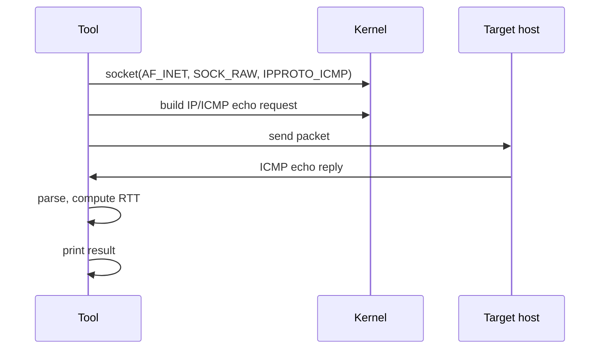
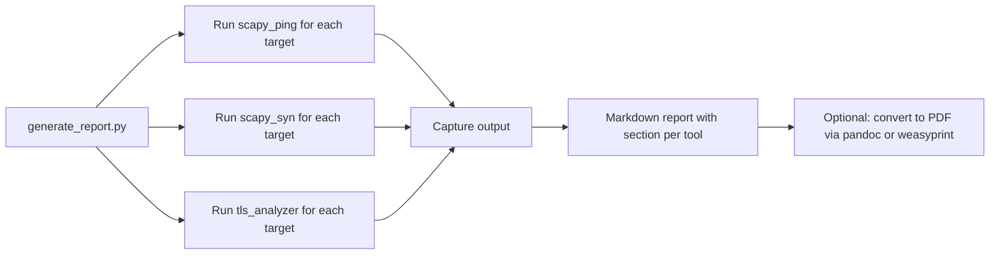

# Architecture

Deep reference for the NetSec Toolkit. The README covers the user-facing tools and outputs; this doc covers the implementation structure, library choices, and report generation.

## Three tools, one toolkit

The toolkit ships three independent Python scripts that share a small set of conventions but no runtime state:

| Script | Purpose | Lines |
|--------|---------|-------|
| `scapy_ping.py` | ICMP ping and traceroute via raw sockets | ~60 |
| `scapy_syn.py` | TCP SYN scanner | 29 |
| `tls_analyzer.py` | TLS certificate analysis | ~150 |
| `generate_report.py` | Aggregate output from all three into a PDF report | 328 |

Each tool is runnable on its own. `generate_report.py` orchestrates them when you want a unified report.

## ICMP ping and traceroute

`scapy_ping.py` uses Scapy's `IP/ICMP` layers to send echo requests and parse responses.

**Ping flow:**

**Traceroute flow:** send packets with TTL=1, 2, 3, ..., until destination is reached or `traceroute_max_ttl` is hit. Each TTL exhaustion produces an ICMP Time Exceeded message from a router along the path. The source IP of each Time Exceeded reveals the next hop.

The implementation uses Scapy's `traceroute()` helper for the actual sending and reply collection.

## TCP SYN scanner

`scapy_syn.py` is the lightweight version of [tcpscan](https://github.com/FardinIqbal/tcpscan), focused only on port openness:

1. Send a TCP SYN to the target port.
2. If response is SYN+ACK, the port is open.
3. If response is RST+ACK, the port is closed.
4. If no response, the port is filtered (firewall dropping).

A SYN scan does not complete the TCP handshake, so it is faster than a full connect scan and slightly less likely to be logged by the target.

## TLS certificate analyzer

The most substantial component. `tls_analyzer.py`:

1. Opens a TCP socket to the target on port 443 (or specified port).
2. Wraps it with `ssl.SSLContext` configured for analysis (cert verification disabled so we can inspect bad certs).
3. Reads the peer certificate via `socket.getpeercert(binary_form=True)`.
4. Decodes it with `cryptography.x509.load_der_x509_certificate`.
5. Extracts and reports:
   - Subject and issuer common names
   - Signature algorithm
   - Validity dates (with days remaining, days expired)
   - Public key algorithm and size (RSA modulus bits, ECC curve)
   - SAN (Subject Alternative Names)
   - Hostname match status
   - TLS version negotiated

### What gets flagged

| Finding | Reason |
|---------|--------|
| Expired cert | Days remaining is negative |
| Expiring soon (≤30 days) | Operational risk |
| Self-signed cert | Subject equals issuer (common name comparison) |
| Hostname mismatch | Requested hostname not in CN or SANs |
| TLS < 1.2 | Outdated protocol |
| RSA < 2048 bits | Below modern minimum |
| MD5 or SHA-1 signature | Cryptographically broken |

## Report generation

`generate_report.py` orchestrates the three tools and produces a Markdown report with output sections for each.

The report is structured as:

1. Executive summary (count of targets, count of issues found)
2. Per-target section
   - Ping: reachability, RTT
   - Port scan: open/closed/filtered ports
   - TLS analysis: cert details, findings
3. Aggregated findings table (all issues across all targets)

## Output format

Each tool produces structured output (currently human-readable; could be made JSON for machine consumption). `generate_report.py` parses the output and combines into Markdown.

## Library choices

- **Scapy** for raw packet manipulation. The standard tool for this work in Python.
- **cryptography** for X.509 parsing. Modern, well-maintained, replaces older `pyOpenSSL` for certificate work.
- **Standard `ssl` module** for opening TLS connections. Lower-level than `requests`, gives access to the raw certificate bytes.
- No external CLI tools (no `nmap` shell-out). Everything is in-process Python.

## Privilege requirements

| Operation | Requires root? |
|-----------|----------------|
| ICMP ping (live) | Yes (raw socket) |
| Traceroute (live) | Yes (raw socket) |
| SYN scan (live) | Yes (raw socket) |
| TLS analysis | No (uses normal TCP socket) |

For non-privileged use, the SYN scan would need to be replaced with a connect scan (full TCP handshake). The current implementation requires `sudo` for the network probes.

## Testing

The test approach is integration-focused: run each tool against known-good and known-bad targets and verify the output structure.

Sample targets in `targets.txt`:

- `expired.badssl.com` (cert expired)
- `self-signed.badssl.com` (self-signed cert)
- `wrong.host.badssl.com` (hostname mismatch)
- `tls-v1-0.badssl.com:1010` (outdated TLS)
- `dh1024.badssl.com` (weak DH)

Run `generate_report.py` against this list and verify each finding is reported.
